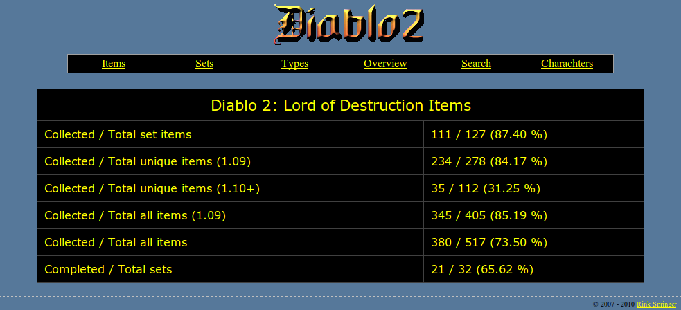
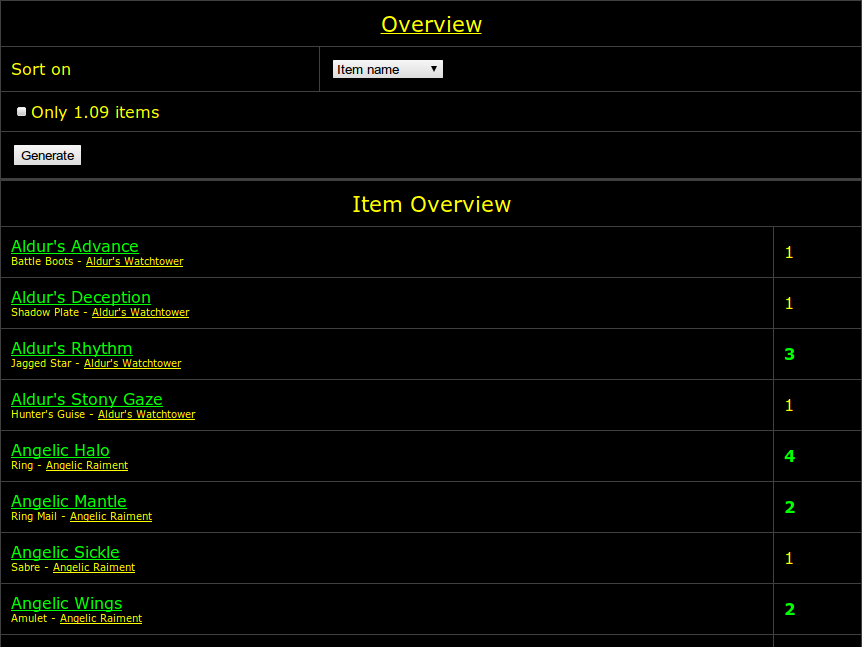
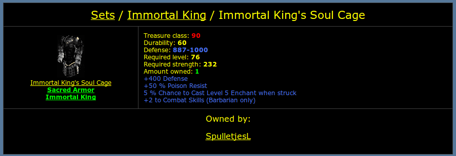
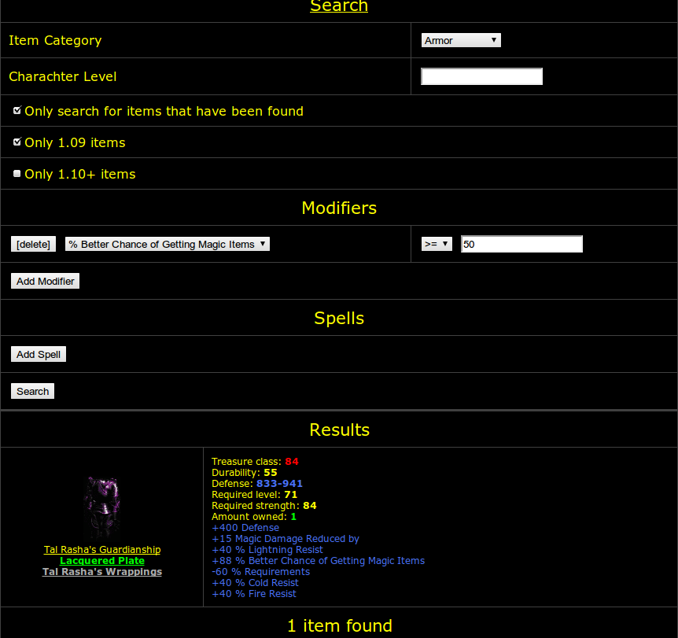

# Diablo2

## Introduction

I used to be quite the Diablo 2: Lord of Destruction player. The simplicity of the game did nothing to prevent me from becoming completely and utterly addicted to it... at least, until I lost my saved games due to faulty backups (sigh, I had about 95% of all items in 1.09). I never quite got the hang of it afterwards, and 1.10 and its successors only made things worse for me.

## Item websites

Either way, during this time, I had this idea of creating this website where players could upload their charachters, and the website would figure out which items you had and how good they are. The website was quite nice and my friends and I used it quite a lot to figure out which items we wanted to share. However, I was not quite satisfied with it (it was coded in a few days, and all data was just copied from the official Diablo2 pages.

Much later, I decided to re-write the complete website so that I could sensibly search for item attributes etc. I decided to use PostgreSQL this time, as I've grown to like over the years. This website is also included at the downloads section, and I'd highly recommend it; it's much more advanced and much cleaner than the old version was.
Savegame reader

The savegame reader was a different story; it was based on _Trevin Beattie's Diablo II 1.09 file format_ along with some improvements by myself. The reader works for most save games; the API is terrible as I never finished the project.

I decided that the old savegame reader was such a mess, and decided to rewrite it, add support for 1.10+ to it and create an actually useful API. This effort has quite likely succeeded, but as my Diablo2 days were over, I never really did anything anymore with the projects... which is why I am releasing everything here, using the GPL version 2.0 or higher.

## License

All images in GIF format are from the Diablo2 game and copyrighted by Blizzard Entertainment. Everything else is released using the GPL version 2 or higher.

## PostgreSQL-based item website screenshots

## Downloads

   * [Diablo2 1.09/1.10+ savegame reader library, including examples](downloads/d2savelib-20100131.tar.bz2) (28KB)
   * [Diablo2 1.09/1.10+ item website (PostgreSQL)](downloads/diablo2-itemsite.pgsql.tar.bz2) (1.6MB)
   * [Legacy Diablo2 1.09 item website (MySQL)](downloads/diablo2-itemsite.mysql.tar.bz2) (688KB)
   * [Legacy Diablo2 1.09 savegame reader](downloads/d2read.tar.bz2) (24KB)
   * [Diablo2 1.09 item save games, 2007-01-21](downloads/d2itemsaves-20070121.zip) (18KB)

